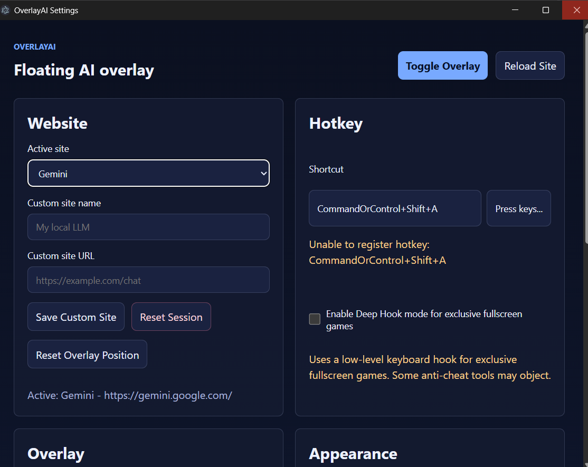
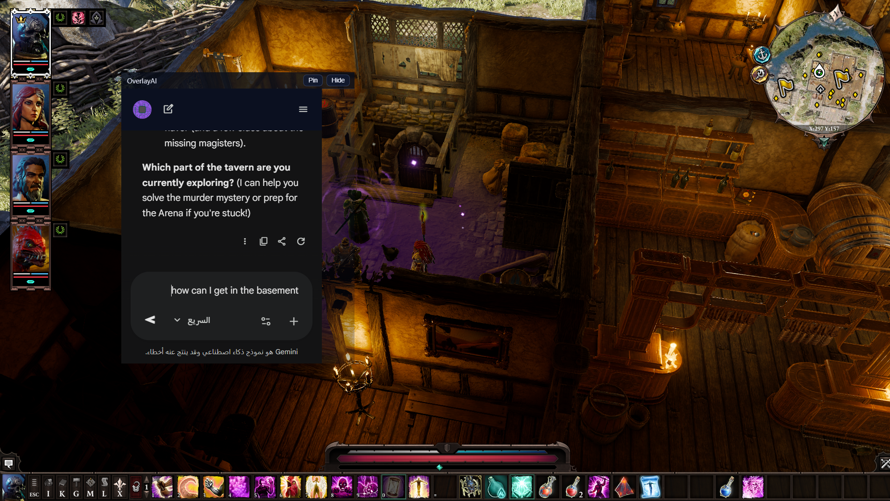
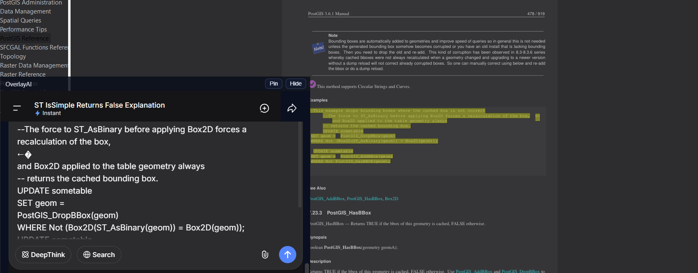

# OverlayAI

OverlayAI is a floating desktop overlay for AI chat websites. It opens the real website in a small always-on-top window, keeps you signed in, and can be shown or hidden quickly while you work or play.





## Download

Download the latest Windows installer from the GitHub Releases page:

`OverlayAI-Setup-0.1.0.exe`

Do not download the source code unless you are a developer. Normal users should use the installer from Releases.

## Install And Run

1. Download `OverlayAI-Setup-0.1.0.exe` from Releases.
2. Open the installer.
3. Follow the setup steps.
4. Launch OverlayAI from the Start menu or desktop shortcut.
5. Choose your AI site in the settings window.
6. Click `Toggle Overlay` or press `Ctrl+Space`.
7. Sign in to the AI website inside the overlay.

OverlayAI remembers your login session after the first sign-in.

## Gaming Setup

OverlayAI works best with games set to `Borderless Windowed`, `Windowed Fullscreen`, or `Borderless Fullscreen`.

True exclusive fullscreen can cause Windows to minimize the game when another app window appears. This is normal Windows behavior for many games. OverlayAI can stay above normal and borderless windows, but it cannot guarantee smooth overlay behavior over every exclusive fullscreen game.

Recommended gaming setup:

1. Set the game display mode to `Borderless Windowed` or `Windowed Fullscreen`.
2. Open OverlayAI before launching the game.
3. Use `Ctrl+Space` to show or hide the overlay.
4. If the overlay does not appear, open settings and click `Reset Overlay Position`.

## When To Use Deep Hook

Use Deep Hook only if the normal hotkey does not work while a game is focused.

Deep Hook helps OverlayAI detect the shortcut when a game captures keyboard input, especially in exclusive fullscreen. It does not force the overlay to draw over every game, and it may still cause some games to minimize when the overlay appears.

Do not enable Deep Hook unless you need it. Some anti-cheat software may flag low-level keyboard hooks, even when they are only used for shortcuts.

OverlayAI does not read game memory, inject DLLs, inspect screen content, or persist the hook after a trigger. The helper listens only for the configured shortcut, triggers once, uninstalls the hook, and exits.

## Custom Sites

1. Paste the website URL in `Custom site URL`.
2. Press `Enter` or click `Save Custom Site`.
3. Click `Toggle Overlay`.
4. If the window is not visible, use `Reset Overlay Position`.

## Selection Assist

Selection Assist is optional.



1. Enable `Selection Assist` in settings.
2. Select text in another app.
3. Copy it with `Ctrl+C`.
4. Press the assist shortcut, default `Ctrl+Shift+Space`.
5. OverlayAI opens and places the copied text into the AI chat box.

## Supported Sites

- ChatGPT
- Claude
- Perplexity
- Gemini
- Copilot
- DeepSeek
- Ollama WebUI
- Custom URLs

## Features

- Floating always-on-top AI chat overlay
- Persistent login sessions per site
- Presets for popular AI chat websites
- Custom URL support
- Standard global hotkey
- Optional Deep Hook mode for games that capture keyboard input
- Optional Selection Assist for copied text
- Reset session button for clean re-login

## Developer Setup

Install dependencies:

```powershell
npm install
```

Run the app:

```powershell
npm start
```

Build the optional Windows deep-hook helper:

```powershell
npm run build:hook
```

Build the Windows installer:

```powershell
npm run dist:installer
```

The installer is created at:

```text
dist/OverlayAI-Setup-0.1.0.exe
```

The `dist/` folder is ignored by Git. Upload the installer through GitHub Releases instead of committing it to the repository.

## Troubleshooting

- If login looks blank or incomplete, click `Reload Site`.
- If the overlay is missing, click `Reset Overlay Position`.
- If a game minimizes, switch the game to borderless/windowed fullscreen.
- If the normal hotkey does not work in a game, try Deep Hook mode.
- Some AI sites change their layout often, so the chrome-hiding CSS may need updates.
